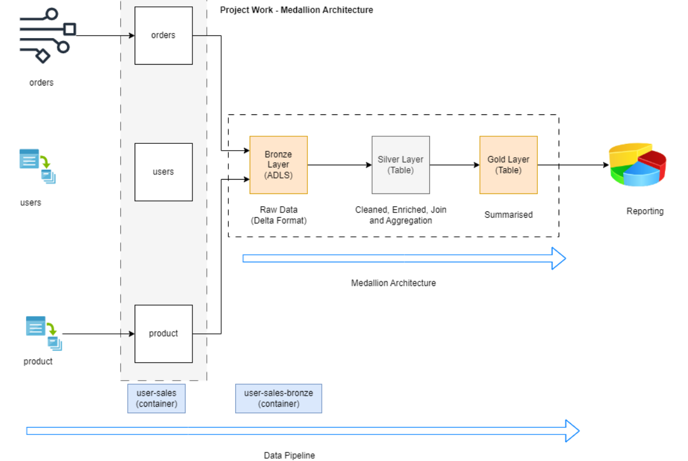

# User Sales Insights Pipeline

## Project Overview

This project implements a data pipeline that processes sales data using the Medallion architecture, consisting of three layers: Bronze, Silver, and Gold. The pipeline ingests raw data from Azure Storage, transforms it through various stages, and stores the processed data in Delta format using Unity Catalog on Azure Data Lake Storage (ADLS). The pipeline includes data enrichment and aggregation steps to derive insights such as top customers and product sales.




## Prerequisites

Before setting up the project, ensure you have the following prerequisites:

1. **Azure Storage Account**: Create an Azure Storage account.
2. **Databricks Workspace**: Set up a Databricks workspace.
3. **Azure Data Lake Storage (ADLS)**: Provision ADLS for storing data in Delta format.
4. **Unity Catalog**: Set up Unity Catalog in Databricks for managing Delta tables.
5. **Databricks CLI**: Install and configure the Databricks CLI.

## Setup

### 1. Azure Storage Setup

1. **Create a Container**: Create a container named `user-sales` in your Azure Storage account.
2. **Upload CSV Files**: Create three folders (`products`, `users`, `orders`) within the `user-sales` container and upload the respective CSV files (`product.csv`, `users_000.csv`, `orders.csv`) into these folders.

### 2. Databricks Workspace Setup

1. **Create Notebooks**:
    - Create a folder named `user-sales-insight-pipeline` in your Databricks workspace.
    - Within this folder, create three notebooks: `bronze_layer`, `silver_layer`, `gold_layer`.

### 3. Notebook Implementation

#### Bronze Layer Notebook

The `bronze_layer` notebook loads the CSV data from the Azure Storage container and stores it in Delta format in the `bronze-user-sales` container in ADLS.

#### Silver Layer Notebook

The `silver_layer` notebook performs data transformations and joins between Delta tables, storing the processed data in Unity Catalog.

#### Gold Layer Notebook

The `gold_layer` notebook generates insights, such as the top 10 customers by total amount purchased and product sales, and stores the results in Delta tables in Unity Catalog.

### 4. Databricks Job Setup

To automate the execution of the notebooks, you need to create a Databricks Job. Follow these steps:

1. **Export Job Configuration**:
    - Save the following configuration as `user-sales-insights-job-config.json`:

    ```json
    {
      "name": "user-sales-insights-job",
      "email_notifications": {
        "no_alert_for_skipped_runs": false
      },
      "webhook_notifications": {},
      "timeout_seconds": 0,
      "max_concurrent_runs": 1,
      "tasks": [
        {
          "task_key": "bronze_layer",
          "run_if": "ALL_SUCCESS",
          "notebook_task": {
            "notebook_path": "/Workspace/Users/your-email/data-engineering/user-sales-insight-pipeline/bronze_layer",
            "source": "WORKSPACE"
          },
          "existing_cluster_id": "your-cluster-id",
          "timeout_seconds": 0,
          "email_notifications": {},
          "notification_settings": {
            "no_alert_for_skipped_runs": false,
            "no_alert_for_canceled_runs": false,
            "alert_on_last_attempt": false
          },
          "webhook_notifications": {}
        },
        {
          "task_key": "silver_layer",
          "depends_on": [
            {
              "task_key": "bronze_layer"
            }
          ],
          "run_if": "ALL_SUCCESS",
          "notebook_task": {
            "notebook_path": "/Workspace/Users/your-email/data-engineering/user-sales-insight-pipeline/silver_layer",
            "source": "WORKSPACE"
          },
          "existing_cluster_id": "your-cluster-id",
          "timeout_seconds": 0,
          "email_notifications": {},
          "notification_settings": {
            "no_alert_for_skipped_runs": false,
            "no_alert_for_canceled_runs": false,
            "alert_on_last_attempt": false
          },
          "webhook_notifications": {}
        },
        {
          "task_key": "gold_layer",
          "depends_on": [
            {
              "task_key": "silver_layer"
            }
          ],
          "run_if": "ALL_SUCCESS",
          "notebook_task": {
            "notebook_path": "/Workspace/Users/your-email/data-engineering/user-sales-insight-pipeline/gold_layer",
            "source": "WORKSPACE"
          },
          "existing_cluster_id": "your-cluster-id",
          "timeout_seconds": 0,
          "email_notifications": {}
        }
      ],
      "queue": {
        "enabled": true
      },
      "run_as": {
        "user_name": "your-email"
      }
    }
    ```

2. **Upload Configuration**:
    - Use the Databricks CLI to upload the JSON configuration and create the job:
    
    ```sh
    databricks jobs create --json-file user-sales-insights-job-config.json
    ```

## Running the Pipeline

1. **Upload Data**: Ensure the CSV files (`product.csv`, `users_000.csv`, `orders.csv`) are uploaded to the `user-sales` container in Azure Storage, with the correct folder structure:

    ```
    user-sales/
    ├── products/
    │   └── product.csv
    ├── users/
    │   └── users_000.csv
    └── orders/
        └── orders.csv
    ```

2. **Execute Databricks Job**:
    - Trigger the Databricks Job from the Databricks UI or CLI to process the data through the Bronze, Silver, and Gold layers.

## Conclusion

This project showcases a robust data pipeline for processing sales data using Azure Storage, Databricks, and Delta Lake with Unity Catalog. By following the steps outlined, you can ingest raw data, perform transformations, and generate meaningful insights. This setup provides a scalable and efficient solution for data processing and analytics.


